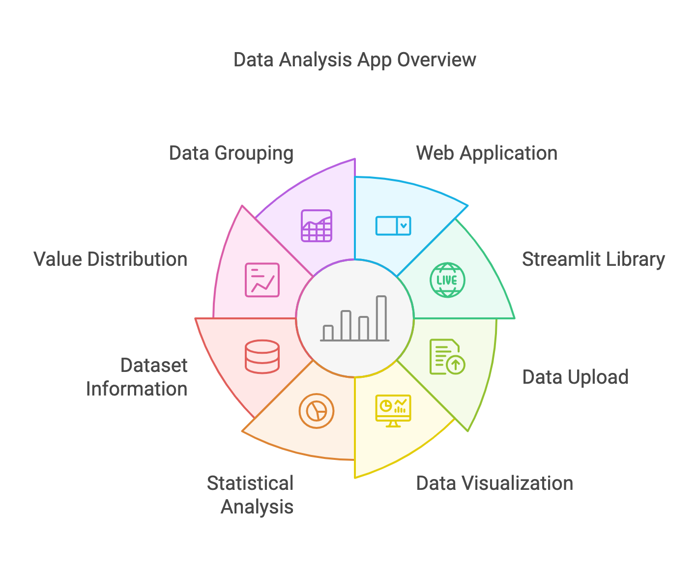

## Environment setup for the data analysis app
 
Import the necessary library

- `pandas` for the data analysis
- `plotly.express` for the data interactive visualizations
- `streamlit` for the web app interface

## Features

1. Web application in the browser tab
2. Use the streamlit Library 
3. Upload Data file 
4. Visualizations data
5. Statistical analysis
6. Basic information for the dataset
7. Quickly visualize the distribution of values within a column
8. Grouping data insights
9. Aggregation functions

    `Sum` `max` `min` `mean` etc

## Files system
- Excel file or CSV file 